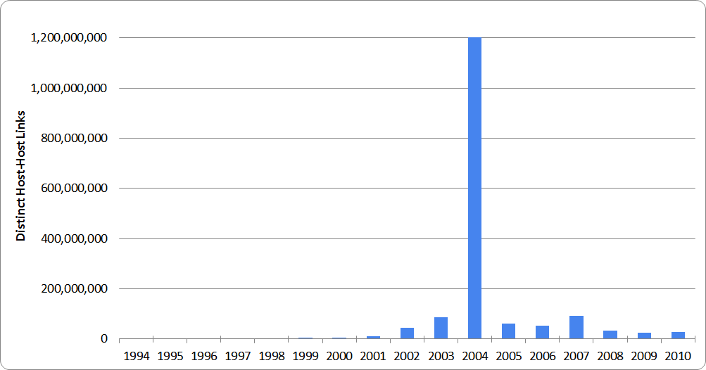

The ~2.5 billion 200 OK responses from the 1996-2010 tranch of the [JISC UK Web Domain Dataset]({{ site.baseurl }}/ukwa.ds.2/) dataset have been scanned for hyperlinks. For each link, we extract the host that the link targets, and use this to build up a picture of which hosts have linked to which other hosts, over time.

This host-level link graph summarises the number of links between hosts, in each year. The data format is a slightly unusual, as you can see from this snippet:

<pre>
1996|appserver.ed.ac.uk|portico.bl.uk   1
1996|art-www.acorn.co.uk|portico.bl.uk  1
1996|astra.ich.ucl.ac.uk|portico.bl.uk  1
1996|back.niss.ac.uk|portico.bl.uk  1
1996|beta.bids.ac.uk|portico.bl.uk  2
1996|blaiseweb.bl.uk|blaiseweb.bl.uk    4
1996|bonsai.iielr.dmu.ac.uk|portico.bl.uk   4
</pre>

There are two tab-separated columns. The first contains three bar-separated fields: the crawl year, the source host, and the target host. The second contains the number of linking URLs. Therefore, the first line:

<pre>
1996|appserver.ed.ac.uk|portico.bl.uk   1
</pre>

represents an assertion that, from the data crawled in 1996, we found one URL on the 'appserver.ed.ac.uk' host that contained a hyperlink to a resource held on 'portico.bl.uk'.

Download
--------

This large dataset cannot be hosted on GitHub. It can be downloaded from [here](http://www.webarchive.org.uk/datasets/ukwa.ds.2/linkage/) instead, in a compressed format (total download size, about 19GB).

Usage
-----

Perhaps the simplest way to exploit this dataset is via the zgrep command. This can be used to extract a subset of the data, pertaining to a particular host or domain. As an example, we have extracted all of the links relating to the British Library website, like this:

    % zgrep "bl.uk" host-linkage.tsv.gz | sort > bl-uk-linkage.tsv

This subset of the data has also been [made available for download](http://www.webarchive.org.uk/datasets/ukwa.ds.2/linkage/).

Issues
------

There are a number of issues that one should be aware of when attempting to interpret this dataset.

### Crawler configuration ###

Be aware that the web archives from which this data was derived had [different crawl techniques applied to it in different years]({{ site.baseurl }}/ukwa.ds.2/#issues). For example crawl de-duplication means that the single resource in the archive which gives rise to:
 
    2008|host1.co.uk|host2.co.uk|1
 
may not show up in the 2009 data as
 
    2009|host1.co.uk|host2.co.uk|1
 
if the resource was present in 2009, but had not changed.
 
Similarly, the difference between the following two statements may be accounted for by the same deduplication:
 
    2008|host3.co.uk|host4.co.uk|100
    2009|host3.co.uk|host4.co.uk|1
 
There may still be 100 linking resources in 2009, but 99 of them may be unchanged and thus absent from this dataset.

### Link farms ###

The following diagram shows the total number of known pairs of linked hosts for each year ([also available as CSV data here](distinct-host-host-links.csv)). 

There is a quite remarkable spike for 2004 - some 1.2 billion extra pairs of linked hosts, over a baseline of about 60 million. Paging through the 2004 results, it seems that this corresponds to a particularly large [link farm](https://en.wikipedia.org/wiki/Link_farm), aiming to game Google's PageRank metric.

Therefore, for 2004 at least, you should consider stripping out domains which host very large numbers of distinct host subdomains. Keep in mind, however, that doing this too aggressively can also throw out valid results from hosted platforms, e.g. blog services.




